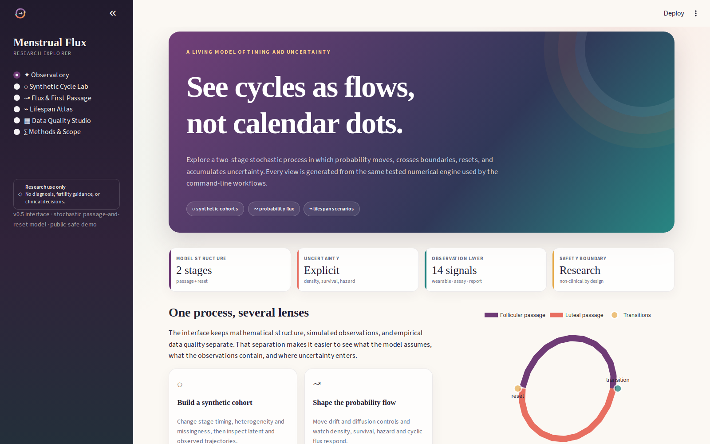
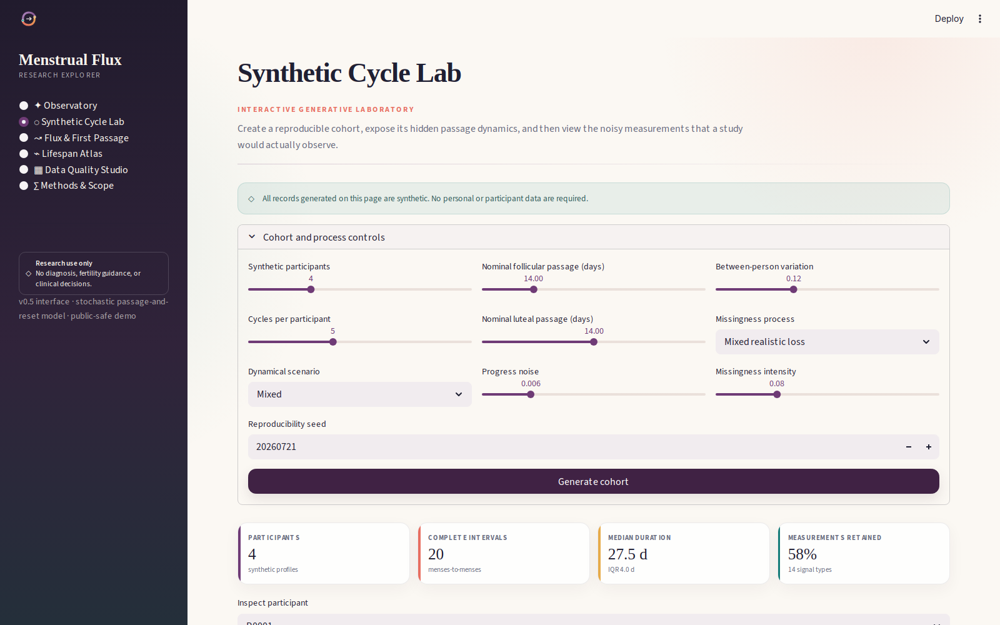
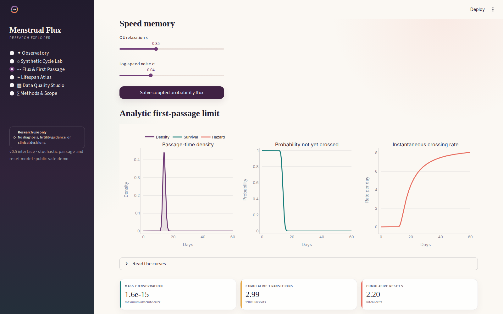
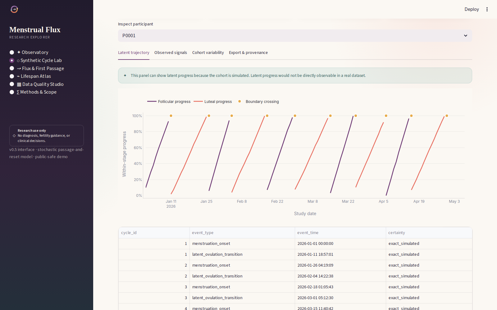
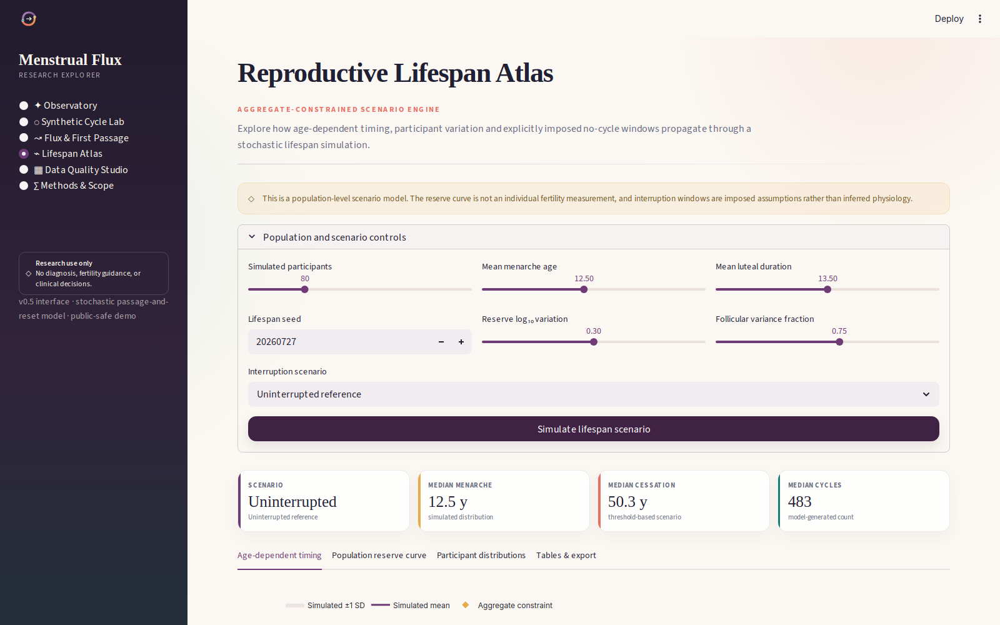
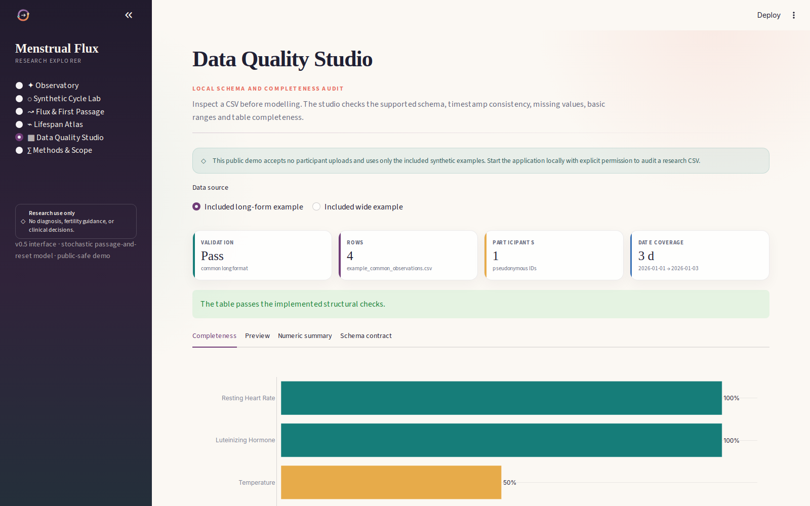

# Menstrual Flux Research Explorer

The Research Explorer is the interactive software interface for Menstrual Flux.
It exposes the stochastic passage-and-reset model through reproducible controls,
interactive graphics, synthetic experiments and data-quality checks.



The interface is intentionally non-clinical. It supports research, teaching,
method development and transparent exploration of model assumptions. It does
not provide diagnosis, contraception, pregnancy planning, confirmed ovulation,
fertility assessment, treatment or triage.

## Explore the application

| Synthetic Cycle Lab | Flux & First Passage |
|---|---|
|  |  |
| Generate reproducible multimodal cohorts with explicit latent truth, participant variation and five missingness modes. | Change drift, diffusion and speed-memory controls; inspect density, survival, hazard and coupled probability transport. |

| Latent trajectory | Lifespan Atlas |
|---|---|
|  |  |
| Inspect simulated stage progress and boundary crossings without implying that latent progress is directly observed in real data. | Explore aggregate-constrained timing and six explicit interruption scenarios from menarche to a modelled cessation threshold. |

| Data Quality Studio |
|---|
|  |
| Validate the included long- and wide-format synthetic examples. Local mode can additionally audit governed research CSV files. |

## Why this is more than a visual mock-up

The GUI calls the tested scientific implementation in `src/digital_twin`
directly. It does not contain replacement equations or precomputed decorative
curves.

- Synthetic controls execute the cohort simulator and observation/missingness
  processes.
- First-passage panels call the analytic density, survival and hazard
  functions.
- Probability-flux panels run the conservative coupled Fokker--Planck solver.
- Lifespan controls run cycle-level stochastic simulations constrained by the
  included aggregate age table.
- Data-quality controls execute the same schema validators used by the CLI.
- Seeds and resolved configurations can be exported for reproducibility.

Automated checks exercise every synthetic scenario, all five missingness modes,
all six lifespan scenarios, extreme flux controls, both supported data layouts,
every application page and each computational action button.

## Run locally

From the repository root:

```bash
python -m pip install -e ".[gui]"
make gui
```

Keep the terminal open and visit `http://127.0.0.1:8501`. Local launches through
`make gui` explicitly enable CSV uploads. See [`../docs/gui.md`](../docs/gui.md)
for alternative ports and SSH tunnelling.

## Public-safe mode

The default application process accepts no arbitrary uploads. This makes the
hosted demo safe for public exploration with the included synthetic examples.
Local research uploads must be enabled explicitly:

```bash
MENSTRUAL_FLUX_ALLOW_UPLOADS=1 \
  PYTHONPATH=src \
  python -m streamlit run app/streamlit_app.py
```

Do not enable participant uploads on a public deployment without appropriate
authentication, authorization, consent, encryption, retention controls and
institutional approval.

## Community Cloud coordinates

Use the following fields when creating the hosted application:

```text
Repository: nalin-dhiman/menstrual_flux
Branch:     main
Entrypoint: app/streamlit_app.py
Python:     3.12
```

The entrypoint-specific `app/requirements.txt` is deliberately separate from
the repository development environment so hosted builds install only the
packages required by the interface.

## Software layout

```text
app/
├── assets/flux_mark.svg
├── requirements.txt
├── screenshots/
├── streamlit_app.py
└── README.md

src/digital_twin/gui/
├── analytics.py
├── plots.py
└── theme.py
```

Presentation, numerical services and plotting are separated so they can be
tested independently.
