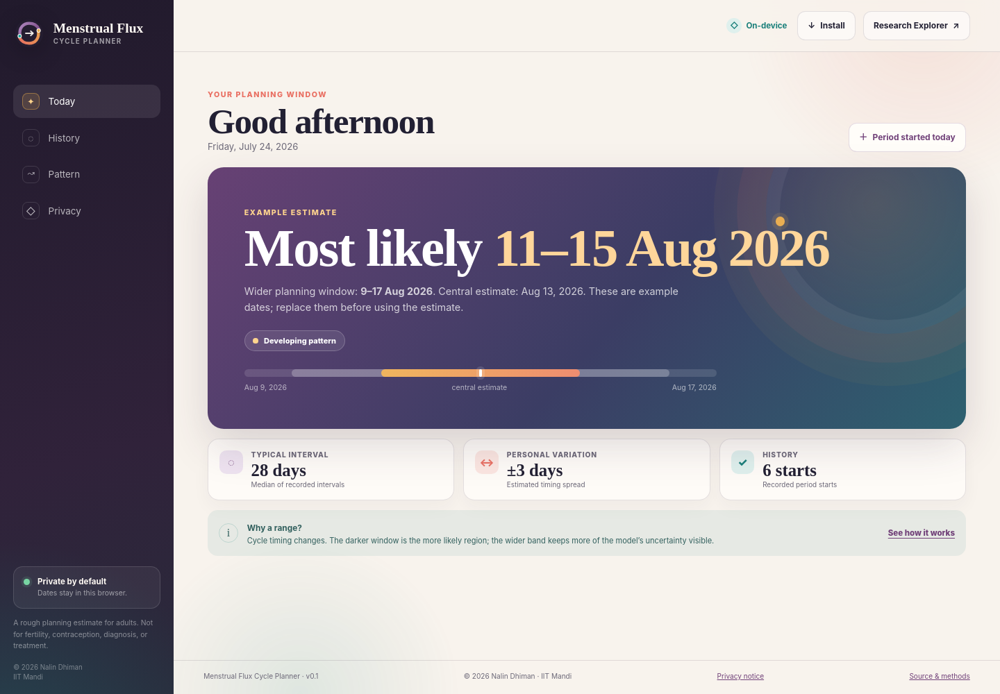
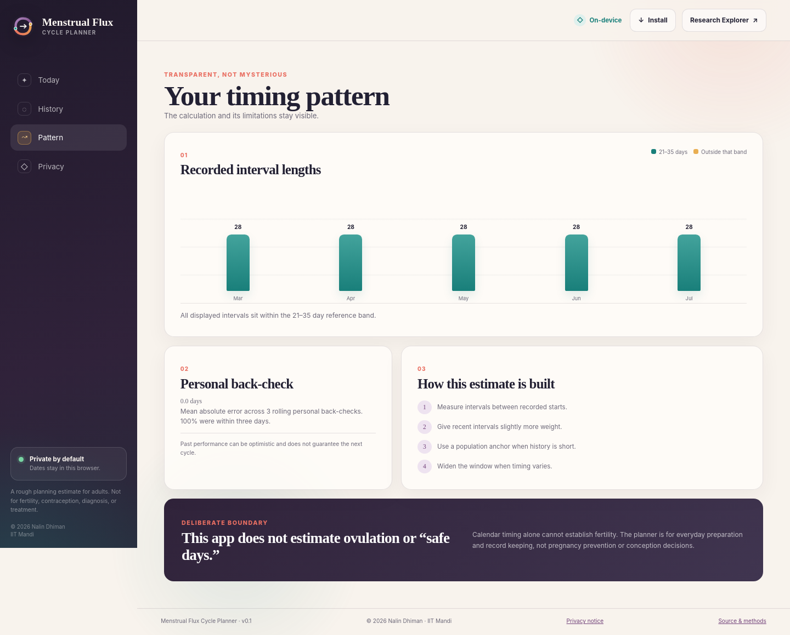
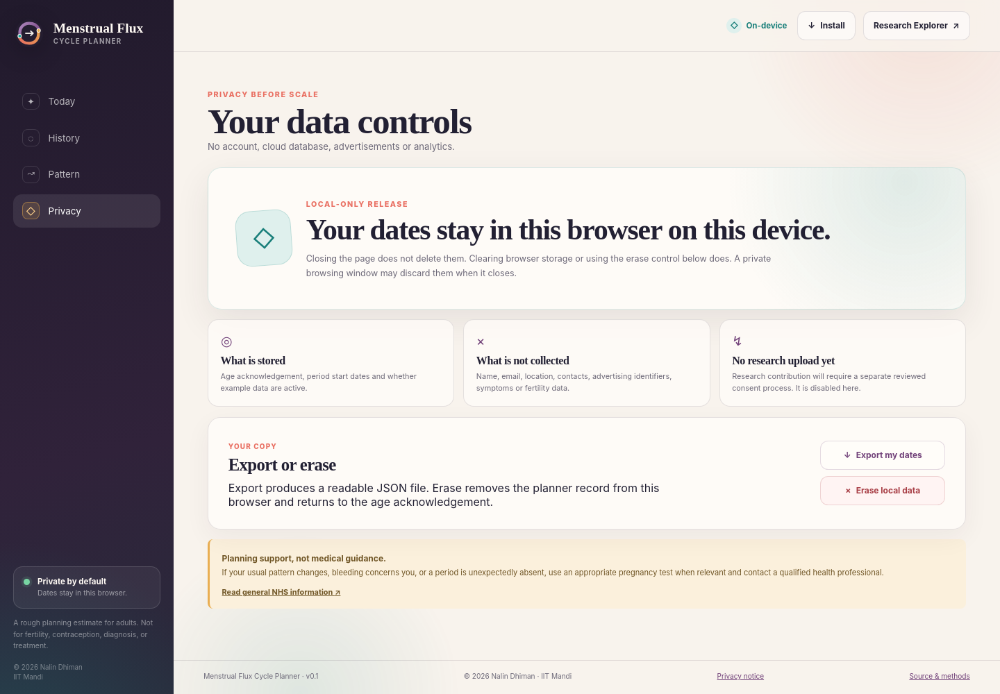
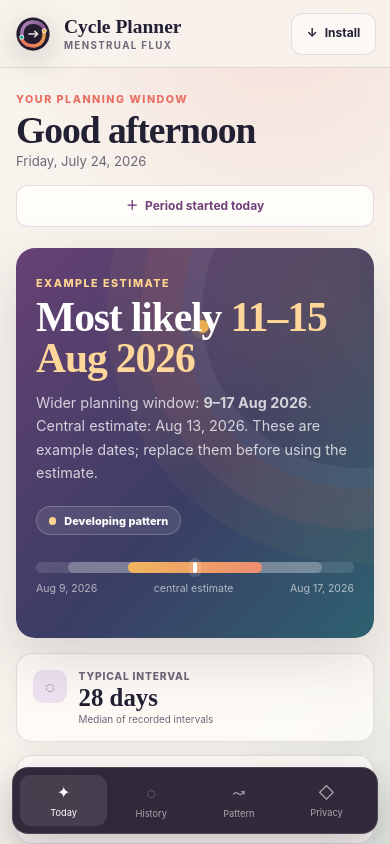

# Menstrual Flux Cycle Planner

The Cycle Planner is a separate, installable Progressive Web App for adults who
want a rough estimate of when their next period may begin. It uses locally
recorded period start dates and communicates timing as nested date ranges.

[Open the public Cycle Planner](https://nalin-dhiman.github.io/menstrual_flux/planner/)

[Open the independent app host](https://menstrual-flux-cycle-planner.drjassneuro.chatgpt.site/)



| Timing pattern | Privacy controls | Installable phone view |
|---|---|---|
|  |  |  |

It is not part of the research-facing Streamlit interface and is not presented
as a clinically validated predictor. It does not estimate ovulation, fertile
windows or "safe days" and must not be used for contraception, conception,
diagnosis or treatment.

## Why one PWA instead of separate web and phone code

The same application works as a normal website and can be installed from a
supported phone or desktop browser. This keeps the forecasting logic, privacy
boundary and tests identical across both experiences. The service worker caches
the application shell for offline use after the first successful visit.

## Privacy boundary

Version 0.1 is deliberately local-only.

- No name, email, date of birth, location, contact list or account is requested.
- Period starts, age acknowledgement and example-mode state are stored in the
  browser's local storage.
- No analytics, advertising SDKs, third-party JavaScript or tracking pixels are
  loaded.
- No cycle record is transmitted to Menstrual Flux or IIT Mandi.
- Users can export a JSON copy and erase the local record from within the app.
- Private-browsing storage may disappear when the private session closes.

The public release has no research-upload endpoint. Any future contribution
feature requires a separate, explicit opt-in consent flow, ethics review,
retention policy, deletion process, access controls and security assessment.
It must not be introduced as a preselected condition of using the planner.

The hosting providers still receive ordinary web requests needed to deliver
the application and may apply infrastructure security controls. Period starts
remain in browser storage and are never inserted into those requests.

The human-readable web notice is available at
[`../docs/site/planner/privacy.html`](../docs/site/planner/privacy.html).

## Forecasting method

The transparent forecasting module is
[`../docs/site/planner/model.mjs`](../docs/site/planner/model.mjs).

1. Dates are normalized and ordered without inventing missing starts.
2. Intervals between consecutive starts are calculated.
3. A robust personal center combines a recent-weighted average and median.
4. Short histories are partially anchored to a 28-day population reference.
5. Median absolute deviation, sample variation and rolling personal residuals
   determine the uncertainty width.
6. The interface shows a narrower likely range and a wider planning range.
7. If the wider range passes, the estimate is marked expired instead of being
   silently moved into the future.

The population anchor is a stabilizer for sparse histories, not an assumption
that every cycle lasts 28 days. Intervals outside 21--35 days remain visible and
widen the estimate; they are not removed from the record. Unusual gaps trigger
a data-entry check but can still be retained.

## Run and test

From the repository root:

```bash
make planner-test
make planner
```

Visit `http://127.0.0.1:8765/planner/`. Automated browser checks cover
acknowledgement, date entry, unusual-gap confirmation, example mode, all four
views, deletion, export, local persistence, offline assets and responsive
layouts.

With the local server running, execute the browser checks from another terminal:

```bash
python consumer_app/tests/browser_check.py
```

## Source layout

```text
consumer_app/
├── README.md
└── tests/model.test.mjs

docs/site/planner/
├── app.css
├── app.js
├── index.html
├── manifest.webmanifest
├── model.mjs
├── privacy.html
├── sw.js
└── assets/

consumer_app/sites/
├── worker.js
└── wrangler.jsonc
```

The Sites deployment packages the same static PWA under
`.open-next/assets/`. Its small edge entrypoint serves those assets and defines
defensive response headers where the runtime path supports them. The HTML also
enforces a restrictive content-security policy and no-referrer policy, so those
controls do not depend on a particular static-asset routing path. No cycle data
is processed by the worker.

Copyright © 2026 Nalin Dhiman. Author affiliation: Indian Institute of
Technology Mandi (IIT Mandi). See [`../COPYRIGHT.md`](../COPYRIGHT.md).
